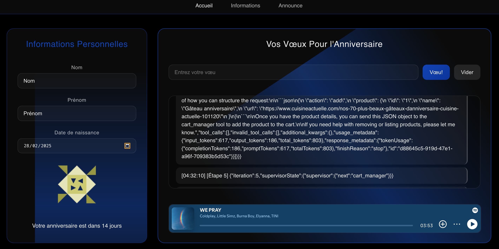

# Test technique Citopia

---
### **Lien vers l'application déployée**

L'application est déployée et accessible via ce lien : [Citopia-JVS test](https://skill-level3.vercel.app)

Démarrer le backend (le réveiller): [Citopia-JVS test-backend](https://mistral-zs6l.onrender.com)



---

### **Frontend**

C'est une application conçue pour illustrer une **expérience utilisateur fluide et réactive** en s'appuyant sur un **système multi-agent supervisé**.

Le **frontend** repose sur **React, Redux, TypeScript, Vite, Yarn, Framer Motion**, garantissant une gestion d'état efficace et une architecture évolutive. Grâce à **Vite**, le projet bénéficie d'un **hot reloading instantané** et de performances accrues.


#### **Points forts du Frontend :**

- **Développement ultra-rapide avec Vite**, réduisant les temps de compilation.
- **Code robuste et maintenable grâce à TypeScript**.
- **Gestion d'état avancée avec Redux**, assurant une synchronisation fluide.
- **UI dynamique et interactive avec React**, optimisée pour une expérience utilisateur engageante.
- **Intégration fluide avec des APIs**, notamment **DummyJSON API**, pour récupérer des données et générer des contenus dynamiques.
- **Optimisations de performance pour une exécution fluide et efficace**.
- **Déploiement rapide et efficace sur Vercel et Render avec Redis pour le caching**.

---

### **Backend - feature mentionnée dans la tâche ("Ajouter une feature qui vous semble intéressante")**

Le **backend** est conçu avec **Node.js, NestJS, Express(avec un adaptateur), TypeScript** et intègre **LangChain, LangGraph et LangSmith** pour orchestrer les workflows multi-agents et RAG, ainsi que **Tavily API et Mistral API** pour enrichir les capacités de traitement des données.


#### **Caractéristiques principales du Backend :**

- **API REST modulaire avec NestJS**, facilitant l’échange de données.
- **Orchestration avancée des agents avec LangChain, LangGraph et LangSmith**.
- **Intégration des APIs Tavily et Mistral** pour enrichir l’analyse et l’interprétation des données.
- **Gestion optimisée des interactions avec un superviseur dédié**.
- **Déploiement sur Render**, assurant scalabilité et fiabilité.

---

### **Installation et exécution locale**

#### **Prérequis**

Avant de lancer l'application en local, assurez-vous d'avoir installé :

- **Node.js** (version 16 ou supérieure)
- **Yarn** (pour la gestion des dépendances du frontend)
- **NPM** (pour la gestion des dépendances du backend)
- **Clés API** pour Tavily API et Mistral API (à configurer dans les fichiers `.env`)

#### **Clonage du projet**

```bash
git clone https://github.com/votre-url-de-repository.git
cd citopia-project
```

#### **Installation et démarrage du frontend (Yarn)**

```bash
cd frontend
yarn install
yarn dev
```

L'application frontend sera accessible à : `http://localhost:5173`

##### **Hot Reloading pour le frontend**

- **Vite** permet un hot reloading instantané en surveillant les fichiers sources et en rechargeant uniquement les composants modifiés.

#### **Installation et démarrage du backend (NPM)**

```bash
cd backend
npm install
npm run start:dev
```

L'API backend sera disponible à : `http://localhost:3001`

##### **Backend**

- **Commande pour un rechargement instantané** :

```bash
npm run start:dev
```

- **Avantages** : Développement rapide sans interruption du serveur.

#### **Configuration des variables d'environnement**

Ajoutez les fichiers `.env` aux répertoires `frontend` et `backend`.

##### **.env pour le Frontend :**

```bash
VITE_BACKEND_URL=http://localhost:3001
```

##### **.env pour le Backend :**

```bash
TAVILY_API_KEY=votre_clé_api_tavily
MISTRAL_API_KEY=votre_clé_api_mistral
```
---

J’ai choisi d’intégrer une approche backend optionnelle pour démontrer une vision plus étendue du projet et explorer des perspectives intéressantes. Ce choix traduit un **investissement personnel pour enrichir et structurer l’application**, tout en conservant la clarté et la maintenabilité du code.

### **Réflexion sur l'expérience de développement**

J’ai pris énormément de plaisir à travailler sur cette tâche. Elle était **stimulante, élégante et enrichissante**, offrant une belle opportunité de faire preuve de **créativité tout en respectant des critères stricts de développement de haut niveau et de bonnes pratiques de développement**.

---
P.S. J’ai ajouté un Easter Egg dans l’Annonce du menu supérieur et Spotify API pour ajouter une ambiance musicale immersive. 🎧✨

---
# Test technique Citopia
## Objectif
- Le test doit être réalisé en utilisant ce dépôt comme base.
- Les travaux devront être testables sans aucune modification à apporter au code ou au paramétrage, et si besoin, en suivant une documentation pas-à-pas.
- Utilisez tous les outils nécessaires pour compléter les tâches.
- Portez une attention particulière à l'historique Git, comme s'il s'agissait d'une situation réelle en projet.

## Finalisation de l'exercice
- Créez une pull request sur le dépôt avec votre travail.
- Le travail doit être testable et documenté.

## Contraintes
### Dans cet exercice, vous devrez utiliser :
- React
- TypeScript

### En option :
- Ajouter une feature qui vous semble interressante
- Utiliser Redux Saga.

## Exercices à réaliser

### R1 : Création de l'application
Créez une application fictive comportant les pages suivantes : Accueil, Informations.

- La page d'accueil devra afficher le contenu défini en R4.
- La page Informations devra afficher le contenu défini en R2.
- L'application devra intégrer une navigation permettant de passer d'une page à l'autre.
- L'application doit pouvoir être facilement lancée en mode développement (avec Hot Reloading) et compilée simplement pour une mise en production.

### R2 : Création d'un formulaire utilisateur
Ajoutez un formulaire sur la page Informations comportant les champs suivants :

- Nom
- Prénom
- Date de naissance

### R3 : Mise à jour automatique des données
Les modifications effectuées dans le formulaire doivent être enregistrées dans un état local sans cliquer sur un bouton "Enregistrer".
Pour ce faire veillez utiliser une solution de *state-management*

### R4 : Affichage dynamique sur la page d'accueil
Sur la page d'accueil :

- Faites un appel à l'API DummyJSON (https://dummyjson.com/docs) pour générer une image dynamique basée sur les données utilisateur (prénom et nom).
- L'image sera a afficher au dessus de la phrase : "Votre anniversaire est dans *X* jours" avec *X* le nombre de jours avant la date d'anniversaire spécifiée dans la partie Informations.
- Attention aux champs qui ne seraient pas encore définis

## Points d'attention
- Organisez votre code pour qu’il soit lisible et maintenable.
- Fournissez une documentation claire sur la manière d'exécuter, tester et déployer le projet.
- Adoptez les bonnes pratiques Git : commits clairs, messages explicites, etc.
- Bonus
    - Ajoutez des tests unitaires ou d’intégration (exemple : Jest, React Testing Library).